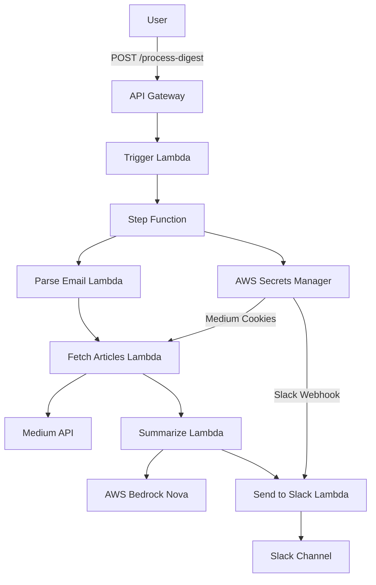

# Design Document

## Overview

The Medium Digest Summarizer is an AWS Serverless application built with Python and AWS CDK that processes Medium Daily Digest emails, extracts article content, generates AI summaries, and sends formatted messages to Slack. The system follows a serverless architecture using AWS Lambda, API Gateway, Secrets Manager, and Bedrock (Nova) services.

## Architecture

### High-Level Architecture



### Component Flow

1. **API Gateway** receives POST requests with email payload
2. **Trigger Lambda** initiates Step Function execution
3. **Step Function** orchestrates the workflow with the following states:
   - Parse Email State (Lambda)
   - Fetch Articles State (Lambda with Map for parallel processing)
   - Summarize Articles State (Lambda with Map for parallel processing)
   - Send to Slack State (Lambda)
4. **Parse Email Lambda** extracts article links from email content
5. **Fetch Articles Lambda** retrieves full article content using stored cookies
6. **Summarize Lambda** generates summaries using AWS Bedrock Nova
7. **Send to Slack Lambda** sends formatted messages to Slack channel

## Components and Interfaces

### 1. API Gateway

**Purpose**: HTTP endpoint for receiving email payloads

**Configuration**:
- REST API with POST method
- CORS enabled for web clients
- Request validation for JSON payload
- Usage plan with 10 requests per day limit
- API key authentication required
- Integration with trigger Lambda function

**Request Format**:
```json
{
  "payload": "Medium Daily Digest email content as JSON string"
}
```

**Response Format**:
```json
{
  "statusCode": 200,
  "message": "Processing completed",
  "articlesProcessed": 3
}
```

### 2. Step Function State Machine

**Purpose**: Orchestrates the entire workflow with error handling and retry logic

**States**:
1. **Parse Email State**: Extract article links from email
2. **Fetch Articles State**: Parallel processing of article fetching
3. **Summarize Articles State**: Parallel processing of article summarization
4. **Send to Slack State**: Send formatted messages to Slack

**Error Handling**:
- Retry policies for each state
- Catch blocks for error handling
- Synchronous execution with immediate response

### 3. Trigger Lambda Function

**Purpose**: Initiate Step Function execution from API Gateway

**Runtime**: Python 3.11
**Memory**: 256 MB
**Timeout**: 30 seconds

**Key Methods**:
- `lambda_handler(event, context)`: Parse API request and start Step Function
- `validate_payload(payload)`: Validate input format

### 4. Parse Email Lambda Function

**Purpose**: Extract article links from Medium email content

**Runtime**: Python 3.11
**Memory**: 256 MB
**Timeout**: 2 minutes

**Key Methods**:
- `lambda_handler(event, context)`: Main entry point
- `parse_email_content(email_html)`: Extract article URLs

### 5. Fetch Articles Lambda Function

**Purpose**: Retrieve full article content from Medium

**Runtime**: Python 3.11
**Memory**: 512 MB
**Timeout**: 3 minutes

**Key Methods**:
- `lambda_handler(event, context)`: Process single article URL
- `fetch_article_content(url, cookies)`: Get article content
- `extract_article_data(html)`: Parse title and content

**Dependencies**:
- `requests` for HTTP requests
- `BeautifulSoup4` for content extraction

### 6. Summarize Lambda Function

**Purpose**: Generate article summaries using AWS Bedrock Nova

**Runtime**: Python 3.11
**Memory**: 256 MB
**Timeout**: 2 minutes

**Key Methods**:
- `lambda_handler(event, context)`: Process single article for summarization
- `generate_summary(content, title)`: Call Bedrock Nova API
- `format_prompt(content)`: Create appropriate prompt

**Configuration**:
- Model: `amazon.nova-pro-v1:0`
- Max tokens: 500
- Temperature: 0.3

### 7. Send to Slack Lambda Function

**Purpose**: Send formatted messages to Slack

**Runtime**: Python 3.11
**Memory**: 256 MB
**Timeout**: 1 minute

**Key Methods**:
- `lambda_handler(event, context)`: Send article summary to Slack
- `format_slack_message(title, summary, url)`: Create Markdown format
- `send_webhook_request(payload)`: HTTP request to Slack

**Message Format**:
```
📌 *{{title}}*

📝 {{summary}}

🔗 link：{{url}}
```

### 8. Secrets Manager Integration

**Purpose**: Secure storage and retrieval of sensitive data

**Secrets Stored**:
- `medium-cookies`: Authentication cookies for Medium
- `slack-webhook-url`: Slack webhook endpoint

**Methods**:
- `get_secret(secret_name: str) -> Dict`: Retrieve secret value
- `handle_secret_errors()`: Error handling for missing/expired secrets

### 9. Step Function Definition

**Purpose**: Define workflow states and transitions

**State Machine Definition**:
```json
{
  "Comment": "Medium Digest Summarizer Workflow",
  "StartAt": "ParseEmail",
  "States": {
    "ParseEmail": {
      "Type": "Task",
      "Resource": "arn:aws:lambda:region:account:function:parse-email",
      "Retry": [{"ErrorEquals": ["States.ALL"], "IntervalSeconds": 2, "MaxAttempts": 3}],
      "Next": "FetchArticles"
    },
    "FetchArticles": {
      "Type": "Map",
      "ItemsPath": "$.articles",
      "MaxConcurrency": 5,
      "Iterator": {
        "StartAt": "FetchSingleArticle",
        "States": {
          "FetchSingleArticle": {
            "Type": "Task",
            "Resource": "arn:aws:lambda:region:account:function:fetch-article",
            "End": true
          }
        }
      },
      "Next": "SummarizeArticles"
    },
    "SummarizeArticles": {
      "Type": "Map",
      "ItemsPath": "$",
      "MaxConcurrency": 3,
      "Iterator": {
        "StartAt": "SummarizeSingleArticle",
        "States": {
          "SummarizeSingleArticle": {
            "Type": "Task",
            "Resource": "arn:aws:lambda:region:account:function:summarize-article",
            "End": true
          }
        }
      },
      "Next": "SendToSlack"
    },
    "SendToSlack": {
      "Type": "Map",
      "ItemsPath": "$",
      "MaxConcurrency": 2,
      "Iterator": {
        "StartAt": "SendSingleMessage",
        "States": {
          "SendSingleMessage": {
            "Type": "Task",
            "Resource": "arn:aws:lambda:region:account:function:send-to-slack",
            "End": true
          }
        }
      },
      "End": true
    }
  }
}
```

## Data Models

### Article Data Model

```python
@dataclass
class Article:
    url: str
    title: str
    content: str
    summary: str = ""
    
    def to_dict(self) -> Dict[str, str]:
        return {
            "url": self.url,
            "title": self.title,
            "content": self.content,
            "summary": self.summary
        }
```

### Processing Result Model

```python
@dataclass
class ProcessingResult:
    success: bool
    articles_processed: int
    errors: List[str]
    execution_time: float
    
    def to_response(self) -> Dict:
        return {
            "statusCode": 200 if self.success else 500,
            "body": {
                "message": "Processing completed" if self.success else "Processing failed",
                "articlesProcessed": self.articles_processed,
                "errors": self.errors,
                "executionTime": self.execution_time
            }
        }
```

## Error Handling

### Error Categories

1. **Input Validation Errors**
   - Missing payload key
   - Invalid JSON format
   - Empty email content

2. **External Service Errors**
   - Medium API rate limiting
   - Bedrock API failures
   - Slack webhook failures

3. **Authentication Errors**
   - Missing or expired Medium cookies
   - Invalid Slack webhook URL

4. **Processing Errors**
   - No articles found in email
   - Article content extraction failures
   - Summary generation failures

### Error Handling Strategy

```python
class ErrorHandler:
    @staticmethod
    def handle_retryable_error(func, max_retries=3):
        """Implement exponential backoff for retryable errors"""
        
    @staticmethod
    def handle_fatal_error(error, context):
        """Log and return appropriate error response"""
        
    @staticmethod
    def send_admin_notification(error):
        """Send critical error notifications"""
```

### Retry Logic

- **Medium API**: 3 retries with exponential backoff (1s, 2s, 4s)
- **Bedrock API**: 3 retries with exponential backoff (2s, 4s, 8s)
- **Slack Webhook**: 3 retries with exponential backoff (1s, 2s, 4s)

## Testing Strategy

### Unit Tests

1. **Email Parser Tests**
   - Test article link extraction from various email formats
   - Test URL validation logic
   - Test edge cases (no links, malformed HTML)

2. **Article Fetcher Tests**
   - Mock Medium API responses
   - Test rate limiting behavior
   - Test content extraction accuracy

3. **AI Summarizer Tests**
   - Mock Bedrock API responses
   - Test prompt formatting
   - Test error handling for API failures

4. **Slack Notifier Tests**
   - Test message formatting
   - Mock webhook requests
   - Test retry logic

### Integration Tests

1. **End-to-End Processing**
   - Test complete pipeline with sample email
   - Verify Slack message delivery
   - Test error scenarios

2. **AWS Service Integration**
   - Test Secrets Manager integration
   - Test Bedrock API integration
   - Test Lambda function deployment

### Performance Tests

1. **Load Testing**
   - Test processing multiple articles simultaneously
   - Measure execution time and memory usage
   - Test rate limiting behavior

2. **Scalability Testing**
   - Test with large email payloads
   - Test concurrent request handling

## Infrastructure as Code (CDK)

### CDK Stack Structure

```python
class MediumDigestSummarizerStack(Stack):
    def __init__(self, scope: Construct, construct_id: str, **kwargs):
        super().__init__(scope, construct_id, **kwargs)
        
        # Lambda functions
        self.trigger_lambda = self._create_trigger_lambda()
        self.parse_email_lambda = self._create_parse_email_lambda()
        self.fetch_article_lambda = self._create_fetch_article_lambda()
        self.summarize_lambda = self._create_summarize_lambda()
        self.slack_lambda = self._create_slack_lambda()
        
        # Step Function
        self.state_machine = self._create_state_machine()
        
        # API Gateway with usage plan
        self.api_gateway = self._create_api_gateway()
        self.usage_plan = self._create_usage_plan()
        self.api_key = self._create_api_key()
        
        # Secrets Manager
        self.secrets = self._create_secrets()
        
        # IAM roles and policies
        self._setup_permissions()
```

### Resource Configuration

1. **Lambda Functions**
   - Runtime: Python 3.11
   - Memory: 256-512 MB (varies by function)
   - Timeout: 30 seconds - 3 minutes (varies by function)
   - Environment variables for configuration

2. **Step Function**
   - Express workflow type for faster execution and lower cost
   - Error handling and retry policies
   - CloudWatch logging enabled
   - Synchronous execution for API Gateway integration

3. **API Gateway**
   - REST API with CORS
   - Request validation
   - Usage plan with 10 requests per day limit
   - API key authentication
   - Integration with trigger Lambda

4. **Secrets Manager**
   - Encrypted storage for sensitive data
   - Automatic rotation policies
   - Cross-service access permissions

5. **IAM Roles**
   - Lambda execution roles (per function)
   - Step Function execution role
   - Bedrock access permissions
   - Secrets Manager read permissions
   - CloudWatch logging permissions

### Deployment Configuration

- **Environment**: Development, Staging, Production
- **Region**: Configurable (default: us-east-1)
- **Monitoring**: CloudWatch logs and metrics
- **Alerting**: SNS notifications for critical errors